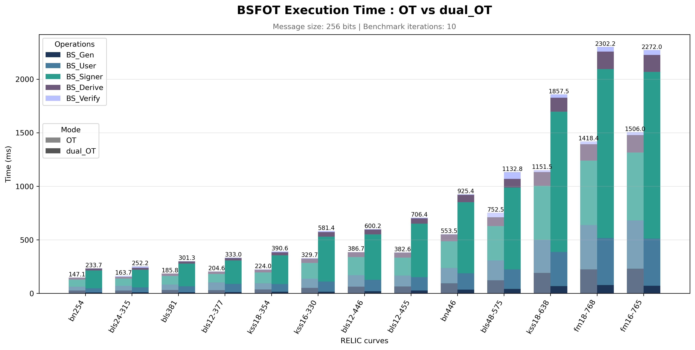

# BSFOT (Blind Signatures From Oblivious Transfer)

<p align="center">
  
</p>

## Requirements

This project requires:

* GCC >= 13
* GNU Make
* Python >= 3.12
* RELIC toolkit

## Compilation & Execution

The project can be compiled and executed in two ways:

| Command               | Description                                                                        |
| --------------------- | ---------------------------------------------------------------------------------- |
| `make`                | Compiles the project with the selected RELIC curve (`bn254` by default)           |
| `make CURVE=<curve>`  | Compiles the project with another RELIC installation (e.g. `bls381`, `kss18-638`) |
| `./main <mode>`       | Executes the protocol for the selected mode                                       |
| `./run_benchmarks.sh <mode>` | Automatically runs benchmarks on all curves defined in `curves.txt` for the selected mode |

The `curves.txt` file contains the list of RELIC curves used for benchmarks.
Each curve must be specified using the exact name of the corresponding RELIC preset.

### Execution Mode

The modes correspond to different versions of the OT (Oblivious Transfer) phase.
Available modes:

| Mode | Protocol     |
| ---- | ------------ |
| `0`  | Classic OT   |
| `1`  | Dual-Mode OT |

Examples:

```bash
make
./main 0
```
Runs the protocol with Classic OT.

```bash
make CURVE=bls12-381
./main 1
```
Runs the protocol with Dual-Mode OT on the BLS12-381 curve.

### Automatic Benchmarks

The `run_benchmarks.sh` script automates performance evaluation on several RELIC curves.
The tested curves are defined in curves.txt.
It requests administrator privileges (sudo) when a RELIC installation is required.
Results are stored in:

```text
results/
├── logs/        # Execution, compilation and RELIC installation logs
└── images/      # Automatically generated graphs
```

#### Cleaning

Remove compilation-generated files:

```bash
make clean
```

## General Project Structure

```text
bsfot/
│
├── main.c                          # Main 
├── makefile                        # Makefile
├── run_benchmarks.sh               # benchmarks script
├── curves.txt                      # List of RELIC curves used for benchmarking
├── display.py                      # Benchmark graph generation
│
│
├── include/
│   ├── common/                     # Shared functions between protocol modes
│   │   ├── benchmark.h             # Performance measurements
│   │   ├── config.h                # Global constants
│   │   ├── io.h                    # Data reading / writing
│   │   ├── keys.h                  # Key generation
│   │   ├── message.h               # Message generation
│   │   ├── params.h                # Public parameters
│   │   ├── run.h                   # Protocol pipeline
│   │   ├── timer.h                 # Timer
│   │   ├── verifier.h              # Signature verification
│   │   └── waters.h                # Waters hash function
│   │
│   ├── classic/                    # Classic OT mode
│   │   ├── signer.h                # Signer functions
│   │   └── user.h                  # User functions
│   │
│   └── dual/                       # Dual-Mode OT mode
│       ├── signer.h                # Signer functions
│       └── user.h                  # User functions
│
├── src/
|   ├── common/                     # Shared implementations
|   │   ├── benchmark.c
|   │   ├── io.c
|   │   ├── keys.c
|   │   ├── message.c
|   │   ├── params.c
|   │   ├── run.c
|   │   ├── timer.c
|   │   ├── verifier.c
|   │   └── waters.c
|   │
|   ├── classic/                    # Classic OT implementation
|   │   ├── signer.c
|   │   └── user.c
|   │
|   └── dual/                       # Dual-Mode OT implementation
|       ├── signer.c
|       └── user.c
|
|
├── results/                        # Benchmark results
│   ├── logs/                       # Execution, compilation and RELIC logs
│   │   ├── *.log
│   │   ├── build_logs/
│   │   └── install_logs/
│   │
│   └── images/                     # Graphs generated by display.py
│       ├── benchmark_*.png
│       ├── keygen_*.png
│       └── verify_*.png
│
├── outputs/                        # Files exchanged during communications
│   ├── classic_ot_keys.bin         # OT keys generated by the user (Classic OT)
│   ├── classic_signer_response.bin # Signer response (Classic OT)
│   ├── classic_signature.bin       # Final signature (Classic OT)
│   ├── dualmod_ot_keys.bin         # OT keys generated by the user (Dual-Mode OT)
│   ├── dualmod_signer_response.bin # Signer response (Dual-Mode OT)
│   └── dualmod_signature.bin       # Final signature (Dual-Mode OT)
│
├── build/                          # Generated object files
│   ├── classic/*.o
│   ├── common/*.o
│   └── dual/*.o
│


```

## Signature Generation Steps

```text
User
 ├─ user_ot_init()
 ├─ user_write_ot_keys_to_file()
 │
 ▼

Signer
 ├─ signer_read_ot_request_from_file()
 ├─ signer_compute_response()
 ├─ signer_write_response_to_file()
 │
 ▼

User
 ├─ user_read_signer_response_from_file()
 ├─ user_compute_signature()
 ├─ user_write_signature_to_file()
 │
 ▼

Verifier
 ├─ verifier_read_signature_from_file()
 └─ verifier_check_signature()
```

## Environment Used

* **OS:** Ubuntu 24.04.4 LTS
* **Kernel:** 6.8.0-136-generic
* **CPU:** 11th Gen Intel(R) Core(TM) i7-1165G7 @ 2.80GHz
* **Logical cores:** 8
* **Memory:** 7,5Gi
* **Compiler:** gcc (Ubuntu 13.3.0-6ubuntu2~24.04.1) 13.3.0
* **Python:** Python 3.12.3