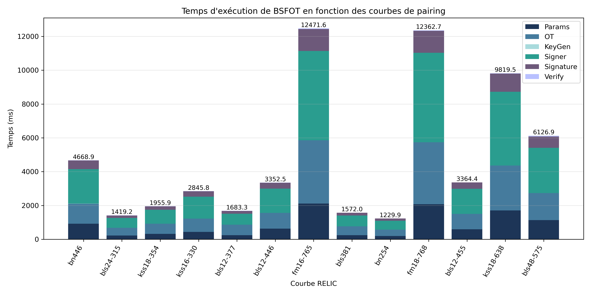

# BSFOT (Blind Signatures from Oblivious Transfer)



## Environment

* **OS:** Ubuntu 24.04.4 LTS
* **Kernel:** 6.8.0-136-generic
* **CPU:** 11th Gen Intel(R) Core(TM) i7-1165G7 @ 2.80GHz
* **Logical cores:** 8
* **Memory:** 7,5Gi
* **Compiler:** gcc (Ubuntu 13.3.0-6ubuntu2~24.04.1) 13.3.0
* **Python:** Python 3.12.3

## Requirements

This project requires:

* GCC >= 13
* GNU Make
* Python >= 3.12
* RELIC toolkit

## Compilation & Execution

The project can be compiled and executed in two ways:

| Command               | Description                                                                        |
| --------------------- | ---------------------------------------------------------------------------------- |
| `make`                | Compiles the project with the selected RELIC curve (`bn254` by default).           |
| `make CURVE=<curve>`  | Compiles the project with another RELIC installation (e.g. `bls381`, `kss18-638`). |
| `./main <mode>`       | Executes the protocol for the selected mode.                                       |
| `./run_benchmarks.sh` | Automatically runs benchmarks on all curves defined in `curves.txt`.               |

The `curves.txt` file contains the list of RELIC curves used for benchmarks.

Example:

```text
bn254
bls12-381
kss18-638
...
```

Each curve directly corresponds to the name of the RELIC preset used during installation.

### Execution Mode

The modes correspond to different versions of the OT (Oblivious Transfer) phase.

Available modes:

| Mode | Protocol     |
| ---- | ------------ |
| `0`  | Classic OT   |
| `1`  | Dual-Mode OT |

Examples:

```bash
make
./main 0
```

Runs the protocol with Classic OT.

```bash
make CURVE=bls12-381
./main 1
```

Runs the protocol with Dual-Mode OT on the BLS12-381 curve.

### Automatic Benchmarks

The `run_benchmarks.sh` script automates performance evaluation on several RELIC curves.

The tested curves are defined in:

```text
curves.txt
```

For each curve, the script:

1. Checks whether the corresponding RELIC installation exists.
2. Automatically installs the curve if necessary in `/opt/`.
3. Compiles the project with this curve.
4. Executes the protocol.
5. Records execution times.
6. Automatically generates comparison graphs.

Launch:

```bash
./run_benchmarks.sh
```

The script requests administrator privileges (sudo) when a RELIC installation is required.

Results are stored in:

```text
results/
├── logs/        # Execution, compilation and RELIC installation logs
└── images/      # Automatically generated graphs
```

#### Cleaning

Remove compilation-generated files:

```bash
make clean
```

## General Project Structure

```text
bsfot/
├── build/                          # Generated object files
├── outputs/                        # Files exchanged during communications
│   ├── classic_ot_keys.bin         # OT keys generated by the user (Classic OT)
│   ├── classic_signer_response.bin # Signer response (Classic OT)
│   ├── classic_signature.bin       # Final signature (Classic OT)
│   ├── dualmod_ot_keys.bin         # OT keys generated by the user (Dual-Mode OT)
│   ├── dualmod_signer_response.bin # Signer response (Dual-Mode OT)
│   └── dualmod_signature.bin       # Final signature (Dual-Mode OT)
│
├── results/                        # Benchmark results
│   ├── logs/                       # Execution, compilation and RELIC installation logs
│   │   ├── *.log
│   │   ├── build_logs/
│   │   └── install_logs/
│   │
│   └── images/                     # Graphs generated by display.py
│       ├── total_time.png
│       └── breakdown.png
│
├── curves.txt                      # List of RELIC curves to test
├── display.py                      # Benchmark graph generation
├── main.c                          # main
├── makefile                        # makefile
├── run_benchmarks.sh               # RELIC installation and multi-curve benchmarks
├── compile_commands.json           # Compilation database
│
├── include/
│   ├── benchmark.h                 # Performance measurements
│   ├── config.h                    # Global constants
│   ├── io.h                        # Data reading / writing
│   ├── keys.h                      # Key generation
│   ├── message.h                   # Message generation
│   ├── params.h                    # Public parameters
│   ├── timer.h                     # Timer
│   ├── run.h                       # Protocol pipeline
│   ├── signer.h                    # Signer functions (Classic OT)
│   ├── signer_dualmode.h            # Signer functions (Dual-Mode OT)
│   ├── user.h                      # User functions (Classic OT)
│   ├── user_dualmode.h             # User functions (Dual-Mode OT)
│   ├── waters.h                    # Waters hash function
│   └── verifier.h                  # Signature verification
│
└── src/
    ├── benchmark.c
    ├── io.c
    ├── keys.c
    ├── message.c
    ├── params.c
    ├── run.c
    ├── signer.c
    ├── signer_dualmode.c
    ├── timer.c
    ├── user.c
    ├── user_dualmode.c
    ├── verifier.c
    └── waters.c
```

## Signature Generation Steps

```text
User
 ├─ user_ot_init()
 ├─ user_write_ot_keys_to_file()
 │
 ▼

Signer
 ├─ signer_read_ot_request_from_file()
 ├─ signer_compute_response()
 ├─ signer_write_response_to_file()
 │
 ▼

User
 ├─ user_read_signer_response_from_file()
 ├─ user_compute_signature()
 ├─ user_write_signature_to_file()
 │
 ▼

Verifier
 ├─ verifier_read_signature_from_file()
 └─ verifier_check_signature()
```
